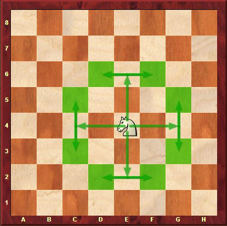
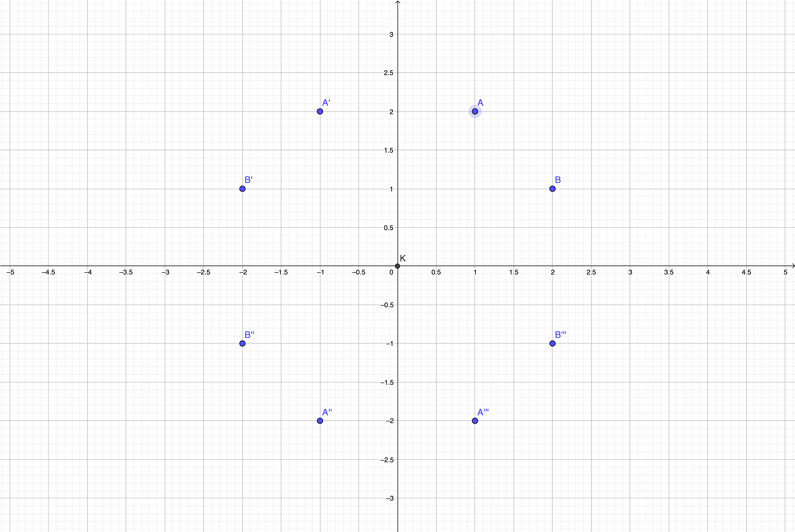
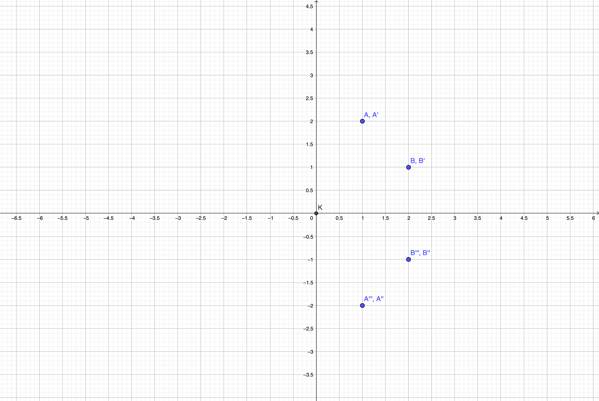
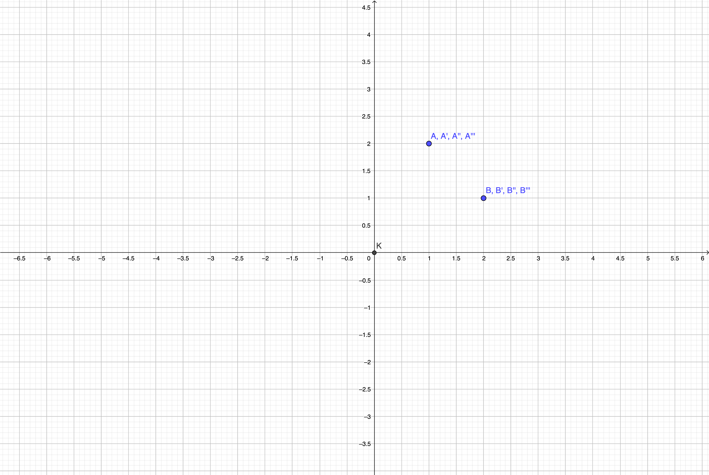

## Задача про коня

> Шахматный конь ходит буквой “Г” — на две клетки по вертикали в любом направлении
> и на одну клетку по горизонтали, или наоборот. Даны две различные клетки
> шахматной доски, определите, может ли конь попасть с первой клетки на вторую
> одним ходом.





## Подготовка

Модуль числа.

`$$ |x| = \left\{
   \begin{array}{rl}
     x, & \text{if }  x \geq 0 \\
     -x, & \text{if } x < 0.
   \end{array}\right. $$`

На примере

`$$ |-5| =  5$$`
`$$ |5| = 5$$`


`$$ (dx, dy) $$`
```
A    ( 1,  2), B    ( 2,  1),
A'   (-1,  2), B'   (-2,  1),
A''  (-1, -2), B''  (-2, -1),
A''' ( 1, -2), B''' ( 2, -1)
```





`$$ (|dx|, dy) $$`
```
A    ( 1,  2), B    ( 2,  1),
A''' ( 1, -2), B''' ( 2, -1)
```





`$$ (|dx|, |dy|) $$`

```
A    ( 1,  2), B    ( 2,  1)
```





```python
dx = abs(x1 - x0)   # |x1 - x0|
dy = abs(y1 - y0)   # |y1 - y0|

if (dx == 1 and dy == 2) or (dx == 2 and dy == 1):
    print("YES")
else:
    print("NO")
```


## Длинное решение

```python
dx = x1 - x0
dy = y1 - y0

if (dx == 1 and dy == 2) or (dx == 2 and dy == 1):
    print("YES")
elif (dx == -1 and dy == 2) or (dx == -2 and dy == 1):
    print("YES")
elif (dx == -1 and dy == -2) or (dx == -2 and dy == -1):
    print("YES")
elif (dx == 1 and dy == -2) or (dx == 2 and dy == -1):
    print("YES")
else:
    print("NO")
```


## Разбор строки с координатами

```python
move = input()     # => 'd5f7'
x0 = ord(move[0])  # ord('d')  => 100
y0 = int(move[1])  # int('5')  => 5
x1 = ord(move[2])  # ord('f')  => 101
y1 = int(move[3])  # int('7')  => 7
```


## Если хотим "нормировать" координаты с буквами

```python
x0 = ord(move[0]) - ord('a')
x1 = ord(move[0]) - ord('a')
# Но это не нужно потому что
dx = x1 - x0
# Что эквивалентно
dx = (ord(move[1]) - ord('a')) - (ord(move[0]) - ord('a'))
   = ord(move[1]) - ord(move[0])
```


## Действительные числа

```python
>>> a = float(4.5)
>>> a - 2     # => 2.5
>>> a / 2     # => 2.25
>>> a * 2     # => 9.0
>>> a // 2    # => 2.0
```


## Библиотека math

```python [1|2|3|4|5]
>>> math.ceil(4.8) # 5
>>> math.ceil(4.2) # ?
>>> math.ceil(-1.5) # ?
>>> math.floor(4.8) # 4
>>> math.floor(-4.1) # ?
```


### Некоторые функции

```python [1|2|3|4|5|6|7-12]
round(x)
round(x, n)
floor(x)
ceil(x)
abs(x)
sqrt(x)
# Тригонометрия
sin(x)
cos(x)
tan(x)
degrees(x)
radians(x)
```
[Подробное описание функций из math](https://pyprog.pro/python/st_lib/math.html)


### Практическая задача

Дано положительное действительное число X. Выведите его первую цифру после десятичной точки. (4. **9** 234523)


#### Решение
``` python
import math

a = float(input())

print(int(a * 10) % 10)

```


## Цикл for
```python
i = 1
for color in 'red', 'orange', 'yellow',
  'green', 'cyan', 'blue', 'violet':
    print('#', i, ' color of rainbow is ', color, sep = '')
    i += 1

####
cities = ['Minsk', 'Gomel', 'Grodno',
  'Vitebsk', 'Mogilev', 'Brest']
for city in cities:
  print(city, ' - city in Belarus')

```


## range

```python
for i in range(4):  # равносильно инструкции for i in 0, 1, 2, 3:
  print(i ** 2)
```


## Цикл while

```python
i = 1
while i <= 10:
  print(i ** 2)
  i += 1
```

```python
i = 1
while i <= 10:
  print(i)
  i += 1
else:
  print('Цикл окончен, i =', i)
```


```python [|5|7]
a = int(input())
while a != 0:
  if a < 0:
    print('Встретилось отрицательное число', a)
    break
  a = int(input())
print('Введен 0')
```


## Утренняя пробежка
Условие
В первый день спортсмен пробежал **`x`** километров, а затем он каждый день увеличивал пробег на **`10%`**
от предыдущего значения. По данному числу **`y`** определите номер дня, на который пробег спортсмена составит не менее **`y`** километров.

Программа получает на вход **действительные** числа `x` и `y` и должна вывести одно натуральное число.


## Решение

```python
a = float(input())
b = float(input())

total = a
counter = 1

while total < b:
  total = total * 1.1
  counter += 1
print(counter)
```

